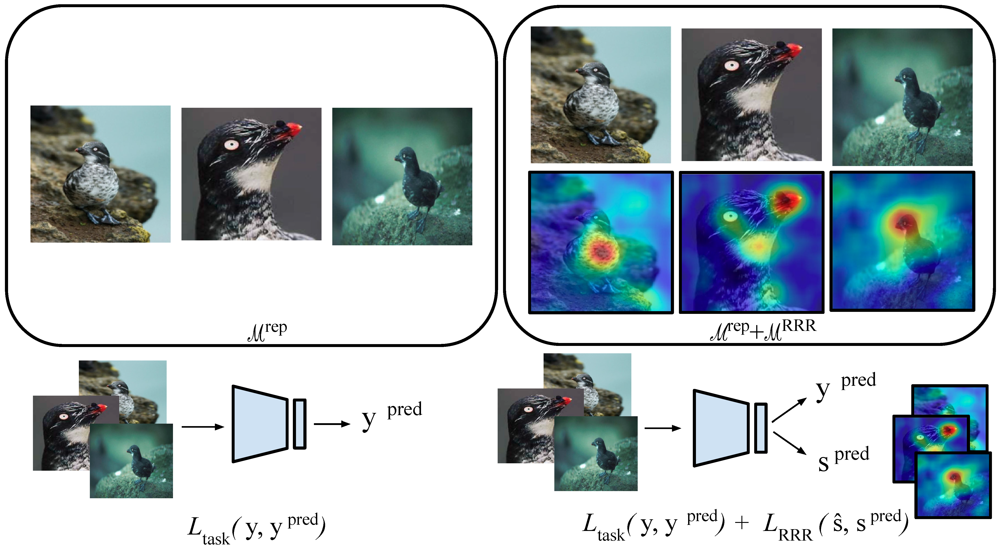

# [Remembering for the Right Reasons: Explanations Reduce Catastrophic Forgetting (ICLR 2021)](https://openreview.net/pdf?id=tHgJoMfy6nI)

This is the PyTorch implementation of [Remembering for the Right Reasons (RRR)](https://openreview.net/pdf?id=tHgJoMfy6nI) published at ICLR 2021.

[[Paper](https://openreview.net/pdf?id=tHgJoMfy6nI)]
[[ICLR Talk](https://iclr.cc/virtual/2021/poster/2950)]
[[Slides](https://www.dropbox.com/s/tl4ss0dpau15yx2/RRR_ICLRSlides.pdf?dl=0)]

### Citation

If using this code, parts of it, or developments from it, please cite our paper:

```
@inproceedings{
ebrahimi2021remembering,
title={Remembering for the Right Reasons: Explanations Reduce Catastrophic Forgetting},
author={Sayna Ebrahimi and Suzanne Petryk and Akash Gokul and William Gan and Joseph E. Gonzalez and Marcus Rohrbach and trevor darrell},
booktitle={International Conference on Learning Representations},
year={2021},
url={https://openreview.net/forum?id=tHgJoMfy6nI}
}
```

### RRR 

The goal of continual learning (CL) is to learn a sequence of tasks without suf- fering from the phenomenon of catastrophic forgetting. Previous work has shown that leveraging memory in the form of a replay buffer can reduce performance degradation on prior tasks. We hypothesize that forgetting can be further reduced when the model is encouraged to remember the evidence for previously made decisions. As a first step towards exploring this hypothesis, we propose a sim- ple novel training paradigm, called Remembering for the Right Reasons (RRR), that additionally stores visual model explanations for each example in the buffer and ensures the model has “the right reasons” for its predictions by encourag- ing its explanations to remain consistent with those used to make decisions at training time. Without this constraint, there is a drift in explanations and in- crease in forgetting as conventional continual learning algorithms learn new tasks. We demonstrate how RRR can be easily added to any memory or regularization- based approach and results in reduced forgetting, and more importantly, improved model explanations. We have evaluated our approach in the standard and few-shot settings and observed a consistent improvement across various CL approaches using different architectures and techniques to generate model explanations and demonstrated our approach showing a promising connection between explainabil- ity and continual learning.



### Prerequisites:
- Linux-64
- Python 3.6
- PyTorch 1.3.1
- NVIDIA GPU + CUDA10 CuDNN7.5


### Installation
- Create a conda environment using the provided `requirements.txt` file:
```bash
conda create -n rrr python=3.6
conda activate rrr
pip install -r requirements.txt
```


- The following structure is expected in the main directory:

```
./src                     : main directory where all scripts are placed in
./data                    : datasets directory 
./checkpoints             : results are saved in here
./requirements.txt        : use to install our utilized packages
```

#### How to run: 


CUB200 (base task 100 classes + 10 tasks = 11 tasks):

`python main.py experiment.ntasks=11 --config ./configs/cub_fascil.yml`


#### Datasets

- *Caltech-UCSD Birds-200-2011 (CUB-200-2011)* dataset can be downloaded from [here](http://www.vision.caltech.edu/visipedia/CUB-200-2011.html). Once downloaded, it should be placed in a sub-folder in `./data` named as `CUB_200_2011`.


## Questions/ Bugs
* For questions/bugs, contact the author Sayna Ebrahimi via email sayna@berkeley.edu


## License
This source code is released under The MIT License found in the LICENSE file in the root directory of this source tree.
